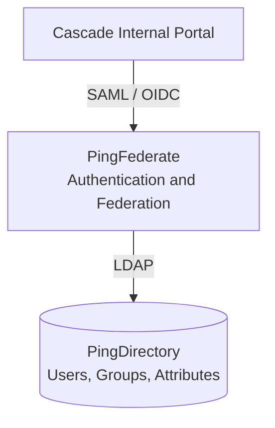
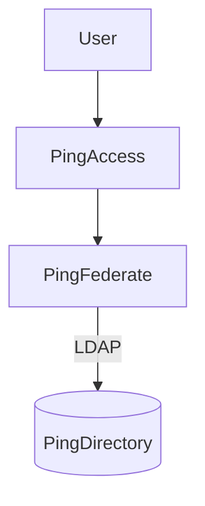
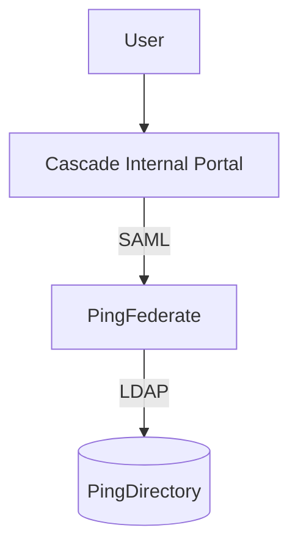
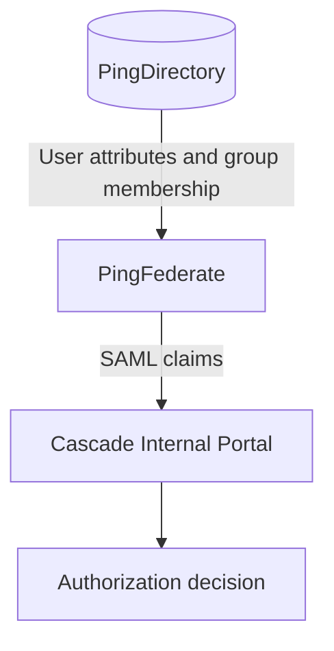
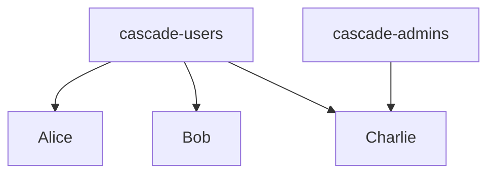
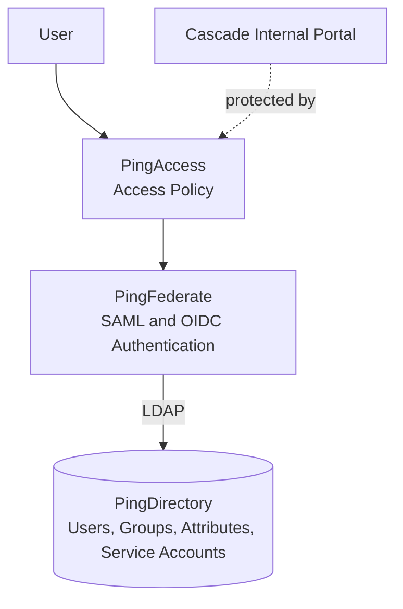

# 🔐 Cascade Internal Portal — Enterprise IAM Lab

**A hands-on Identity and Access Management lab built around a custom internal web application and the Ping Identity platform.**

---

## Table of Contents

- [Project Overview](#project-overview)
- [Target Architecture](#target-architecture)
- [Application](#application)
- [Labs](#labs)
  - [Lab 1: PingDirectory](#lab-1-pingdirectory)
  - [Lab 2: PingFederate and PingDirectory](#lab-2-pingfederate-and-pingdirectory)
  - [Lab 3: SAML Single Sign-On](#lab-3-saml-single-sign-on)
  - [Lab 4: SAML Attributes and Authorization](#lab-4-saml-attributes-and-authorization)
  - [Lab 5: OpenID Connect](#lab-5-openid-connect)
  - [Lab 6: Production-Level IAM Enhancements](#lab-6-production-level-iam-enhancements)
  - [Lab 7: PingAccess](#lab-7-pingaccess)
- [Final Architecture](#final-architecture)
- [Status](#status)

---

A hands-on Identity and Access Management (IAM) project built around a
custom internal web application and the Ping Identity platform.

The goal of this project is to build an enterprise-style identity
architecture step by step, starting with the identity directory and
progressively introducing authentication, federation, authorization,
OIDC, MFA, and access management.

---

## Project Overview

The project uses the **Cascade Internal Portal** as the target
application for the IAM implementation.

The IAM environment is being built progressively using:

- PingDirectory
- PingFederate
- PingAccess
- LDAP
- SAML 2.0
- OpenID Connect (OIDC)
- MFA
- Attribute-based authorization

The implementation is intentionally divided into separate labs so that
each technology and IAM concept can be understood, configured, tested,
and documented independently before being integrated into the final
architecture.

---

## Target Architecture

The initial architecture will be:

PingAccess will be introduced later as an access management and policy
enforcement layer.

The final architecture will evolve toward:

---

# Application

## Cascade Internal Portal

The Cascade Internal Portal is the application used as the target
application for this IAM project.

The application provides the environment in which the authentication
and authorization flows will eventually be tested.

The application will be integrated with PingFederate using:

* SAML 2.0
* OpenID Connect

Application-level TOTP is currently **out of scope** for this project.
The focus is on SAML and OIDC authentication, followed by
authorization and production-level IAM enhancements.

---

# Labs

The project is divided into progressive labs.

## Lab 1: PingDirectory

### Objective

Build and understand the LDAP-based identity store that will be used
by PingFederate.

Topics include:

* PingDirectory
* LDAP
* Directory Information Tree (DIT)
* Base DN
* Distinguished Names (DN)
* Relative Distinguished Names (RDN)
* Organizational Units
* LDAP entries
* Object classes
* User attributes
* Groups
* Group membership
* Service accounts
* LDAP bind
* LDAP search
* LDAP filters
* Search scope
* LDIF
* Directory verification

The result of this lab will be a functional identity directory
containing users, groups, attributes, and a service account that can
later be consumed by PingFederate.

---

## Lab 2: PingFederate and PingDirectory

### Objective

Connect PingFederate to the PingDirectory identity store and establish
the authentication foundation for the project.

Topics include:

* PingFederate administration
* LDAP Identity Source
* LDAP connection configuration
* Bind credentials
* User search
* LDAP search filters
* Authentication
* Authentication policies
* IdP Adapter
* Attribute retrieval
* Authentication testing
* Troubleshooting

---

## Lab 3: SAML Single Sign-On

### Objective

Implement SAML-based Single Sign-On between the Cascade Internal Portal
and PingFederate.

Architecture:

Topics include:

* SAML 2.0
* Service Provider (SP)
* Identity Provider (IdP)
* Entity ID
* ACS URL
* SAML metadata
* Browser SSO
* Authentication requests
* SAML assertions
* NameID
* Assertion signing
* Certificates
* Attribute contracts
* Attribute fulfillment
* SAML troubleshooting

The goal is to achieve a working SAML login to the Cascade Internal
Portal.

---

## Lab 4: SAML Attributes and Authorization

### Objective

Extend the SAML implementation to pass identity and authorization
attributes from PingDirectory through PingFederate to the application.

Example:

Topics include:

* Attribute contracts
* Attribute fulfillment
* LDAP attributes
* Group membership
* SAML claims
* Roles
* Groups
* Role-based access
* Attribute-based access
* Application authorization
* Admin access
* Authorization troubleshooting

Example:

The goal is to demonstrate how identity attributes can be used to
control access within an application.

---

## Lab 5: OpenID Connect

### Objective

Implement OpenID Connect authentication between the Cascade Internal
Portal and PingFederate.

Topics include:

* OAuth 2.0 fundamentals
* OpenID Connect
* Authorization Code Flow
* Client registration
* Client ID
* Client Secret
* Redirect URI
* Authorization endpoint
* Token endpoint
* ID Token
* Access Token
* Claims
* Scopes
* State
* Nonce
* JWT
* JWKS
* Token validation
* OIDC troubleshooting

The goal is to implement a working OIDC authentication flow and compare
it with the SAML implementation.

---

## Lab 6: Production-Level IAM Enhancements

### Objective

Move the laboratory environment toward a more production-oriented
security architecture.

Potential topics include:

* Multi-factor authentication
* Step-up authentication
* Authentication policies
* TLS
* LDAPS
* Certificate management
* Certificate rotation
* Service-account security
* Least privilege
* Logging
* Monitoring
* Auditing
* Backup and recovery
* High availability concepts
* Security hardening

These capabilities will be introduced only after the core
authentication and authorization architecture is working.

---

## Lab 7: PingAccess

### Objective

Introduce PingAccess as the access management and policy enforcement
layer.

Topics will include:

* PingAccess architecture
* Reverse proxy concepts
* Application configuration
* Web access management
* Access policies
* Policy enforcement
* PingFederate integration
* Protected applications
* Authentication enforcement
* Authorization enforcement
* Troubleshooting

The goal is to understand how PingAccess fits into an enterprise IAM
architecture rather than treating it as an isolated product.

---

# Final Architecture

After completing the labs, the target architecture will resemble:

The Cascade Internal Portal will serve as the application protected by
this architecture.

---

# Status

| Lab   | Technology                      | Status         |
| ----- | -------------------------------- | -------------- |
| Lab 1 | PingDirectory                   | ✅ Complete    |
| Lab 2 | PingFederate + LDAP             | ⬜ Not Started |
| Lab 3 | SAML SSO                        | ⬜ Not Started |
| Lab 4 | SAML Attributes & Authorization | ⬜ Not Started |
| Lab 5 | OpenID Connect                  | ⬜ Not Started |
| Lab 6 | Production Hardening            | ⬜ Not Started |
| Lab 7 | PingAccess                      | ⬜ Not Started |
