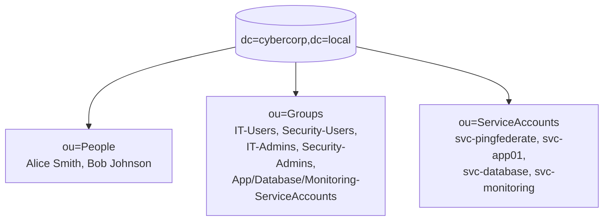

# Lab 1 - PingDirectory

## Objective

This lab focuses on verifying and building out a PingDirectory-based
LDAP identity store: a Directory Information Tree (DIT) for a
fictitious organization, CyberCorp (`dc=cybercorp,dc=local`), that
will serve as the identity source for the Cascade Internal Portal IAM
architecture.

The tree includes organizational units for people, groups, and service
accounts; sample user identities; sample groups; and a dedicated
service account that PingFederate can use to perform LDAP-based user
lookups. Every configuration change is verified independently with
`ldapsearch`, and the PingFederate service account is granted scoped
read access to the People branch via an Access Control Instruction
(ACI).

This lab focuses exclusively on PingDirectory and LDAP fundamentals.
PingFederate, SAML, OIDC, PingAccess, and MFA are covered in later
labs.

## Architecture

PingFederate will bind as `svc-pingfederate` and search the People
branch to authenticate users such as Alice Smith.

## Topics

- PingDirectory
- LDAP
- Directory Information Tree (DIT)
- Base DN
- Distinguished Names (DN)
- Relative Distinguished Names (RDN)
- Organizational Units
- LDAP entries
- Object classes
- User attributes
- Groups
- Group membership
- Service accounts
- LDAP bind
- LDAP search
- LDAP filters
- Search scope
- LDIF
- Directory verification

## Learning Outcomes

- Understand how a PingDirectory Directory Information Tree (DIT) is structured with organizational units, users, groups, and service accounts.
- Create and verify directory entries using `dsconfig`, `ldapmodify`, and `ldapsearch`.
- Understand the difference between LDAP object classes, attributes, and schema constraints.
- Configure and scope an Access Control Instruction (ACI) to grant a service account least-privilege read access.
- Distinguish between authentication (binding) and authorization (what a bound identity is allowed to see).
