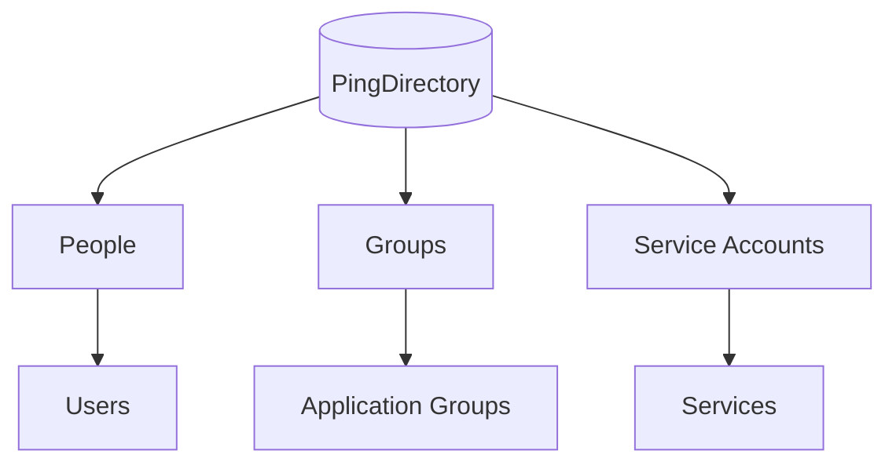

# Lab 1 - PingDirectory

**Status:** In Progress

## Contents

- [Objective](#objective)
- [Architecture](#architecture)
- [Topics](#topics)
- [Prerequisites](#prerequisites)
- [Concepts](#concepts)
- [Installation](#installation)
- [Configuration](#configuration)
- [Commands](#commands)
- [Testing](#testing)
- [Troubleshooting](#troubleshooting)
- [Security Considerations](#security-considerations)
- [Screenshots and Evidence](#screenshots-and-evidence)
- [Lessons Learned](#lessons-learned)

---

## Objective

Build and validate a PingDirectory-based LDAP identity store that will
serve as the identity source for the Cascade Internal Portal IAM
architecture.

This lab focuses exclusively on PingDirectory and LDAP fundamentals.
PingFederate, SAML, OIDC, PingAccess, and MFA are outside the scope of
this lab.

---

## Architecture

---

## Topics

- PingDirectory
- LDAP
- Directory Information Tree (DIT)
- Base DN
- Distinguished Names (DN)
- Relative Distinguished Names (RDN)
- Organizational Units
- LDAP entries
- Object classes
- User attributes
- Groups
- Group membership
- Service accounts
- LDAP bind
- LDAP search
- LDAP filters
- Search scope
- LDIF
- Directory verification

---

## Prerequisites

_To be documented._

## Concepts

_To be documented._

## Installation

_To be documented._

## Configuration

_To be documented._

## Commands

_To be documented._

## Testing

_To be documented._

## Troubleshooting

_To be documented._

## Security Considerations

_To be documented._

## Screenshots and Evidence

_To be documented._

## Lessons Learned

_To be documented._

---

See the root [README.md](../README.md) for the full project overview.
